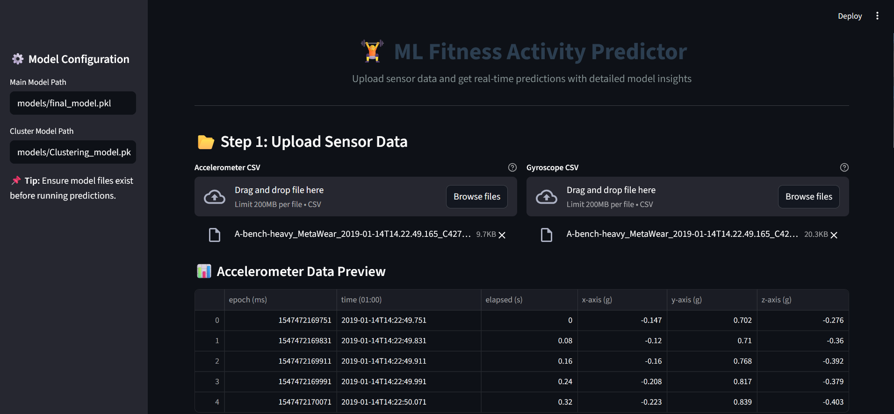

# ML Fitness Activity Predictor



<p align="center">
    <a href="https://ml-fitness-tracker.streamlit.app/"></a>
    <a href="https://www.python.org/downloads/"></a>
    <a href="LICENSE"></a>
    <a href="https://github.com/yourusername/ml-fitness-tracker"></a>
</p>

**Live Demo:** [Explore the Streamlit Demo](https://ml-fitness-tracker.streamlit.app/) 🚀  

---

## 📋 Overview

The **ML Fitness Activity Predictor** is a comprehensive data science project designed to classify strength training activities, count repetitions, and detect improper form using wrist-worn accelerometer and gyroscope data. Inspired by *Mini Master Project - Exploring the Possibilities of Context-Aware Applications for Strength Training* by Dave Ebbelaar, this project leverages advanced machine learning and signal processing techniques to deliver actionable insights for fitness enthusiasts, researchers, and developers.

Built with a robust pipeline, the project processes raw sensor data, applies sophisticated feature engineering, and employs Random Forest models to achieve over 98% classification accuracy. A Streamlit demo showcases the results, but the core strength lies in its data science methodology, making it a powerful tool for human activity recognition (HAR) in strength training.

**Key Highlights**:
- **Advanced Data Science**: Combines signal processing, feature engineering, and ensemble learning for high accuracy.
- **Real-World Impact**: Promotes safer workouts through improper form detection.
- **Open-Source**: Fully extensible with Python, scikit-learn, and custom modules.

As of August 11, 2025, this project pushes the boundaries of fitness tracking with a focus on precision and safety.

---

## ✨ Features

- **Activity Classification** 🏋️‍♂️: Accurately identifies exercises (e.g., Bench Press, Squat, Deadlift, Overhead Press, Row) from sensor data.
- **Repetition Counting** 🔢: Counts reps with a 5% error rate using peak detection on filtered signals.
- **Form Detection** ⚠️: Detects improper form (e.g., bench press errors like bar placement) to prevent injuries.
- **Data Preprocessing** 🛠️: Robust pipeline with outlier removal, low-pass filtering, PCA, and temporal/frequency abstractions.
- **Interactive Demo** 📊: Streamlit interface for uploading CSV files, configuring models, and visualizing predictions.
- **Scalable Architecture** ⚙️: Modular design for easy integration with new data or models.

---

## 🚀 Data Science Techniques

This project employs state-of-the-art data science techniques to transform raw sensor data into actionable insights:

- **Signal Processing** 🔉:
  - **Low-Pass Filtering**: Applies Butterworth filters (cutoff=1.3Hz for classification, 0.4Hz for rep counting) to remove high-frequency noise, preserving motion patterns.
  - **Outlier Removal**: Uses Chauvenet’s criterion to detect and interpolate outliers, ensuring data quality.

- **Feature Engineering** 🧬:
  - **Temporal Abstraction**: Computes mean and standard deviation over 4-second windows to capture time-domain patterns.
  - **Frequency Abstraction**: Extracts Fourier transform features (e.g., max frequency, power spectral entropy) to model periodic movements.
  - **Principal Component Analysis (PCA)**: Reduces dimensionality to 3 components, capturing 95%+ variance.
  - **Magnitude Features**: Calculates Euclidean norms (`acc_r`, `gyr_r`) for orientation-invariant features.
  - **Clustering**: Applies KMeans (k=4) to group accelerometer data, enhancing classification with cluster labels.

- **Machine Learning** 🤖:
  - **Random Forest Classifier**: Achieves 98.51% accuracy with grid-searched hyperparameters (n_estimators=100, min_samples_leaf=2) on feature_set_4.
  - **Forward Feature Selection**: Identifies top features for optimal performance (training script).
  - **Cross-Validation**: Evaluates generalization using random and participant-based splits, addressing inter-user variability.

- **Evaluation Metrics** 📈:
  - Confusion matrices for detailed class-wise performance.
  - Precision, recall, and F1-score to ensure robust results beyond accuracy.

These techniques, grounded in the principles of *Machine Learning for the Quantified Self*, make the project a robust solution for HAR in strength training.

---

## 🛠️ Getting Started

### Prerequisites
- Python 3.10+ 🐍
- Virtual environment (recommended)
- MetaWear sensor data (CSV format with epoch timestamps, x/y/z values)

### Installation
1. Clone the repository:
   ```bash
   git clone https://github.com/yourusername/ml-fitness-tracker.git
   cd ml-fitness-tracker
   ```

2. Create and activate a virtual environment:
   ```bash
   python -m venv venv
   source venv/bin/activate  # On Windows: venv\Scripts\activate
   ```

3. Install dependencies:
   ```bash
   pip install -r requirements.txt
   ```
   Dependencies include: `streamlit`, `pandas`, `numpy`, `scikit-learn`, `joblib`, `scipy`.

4. Download pre-trained models (place in `models/` folder):
   - `final_model.pkl`: Random Forest for activity classification.
   - `Clustering_model.pkl`: KMeans for clustering.
   - `feature_set_4.npy`: Selected feature set for prediction.

### Running the Project
- **Train Models** (optional, if retraining):
   ```bash
   python src/train_model.py
   ```
- **Run Streamlit Demo**:
   ```bash
   streamlit run app.py
   ```
   Open [http://localhost:8501](http://localhost:8501) in your browser.

---

## 📖 Usage

1. **Prepare Data** 📂:
   - Use accelerometer and gyroscope CSV files from MetaWear sensors (e.g., `A-bench-heavy_..._Accelerometer_12.500Hz_1.4.4.csv`).
   - Ensure files include `epoch (ms)`, `acc_x`, `acc_y`, `acc_z`, `gyr_x`, `gyr_y`, `gyr_z`.

2. **Launch Streamlit Demo** 🌐:
   - Upload CSV files via the interface.
   - Configure model paths in the sidebar (defaults: `models/final_model.pkl`, `models/Clustering_model.pkl`).
   - Click **Analyze Workout** to get predictions.

3. **View Results** 📊:
   - **Activity**: Predicted exercise (e.g., "Bench Press").
   - **Repetitions**: Counted reps with ~95% accuracy.
   - **Form Feedback**: Alerts for improper form (e.g., "Bar too high" for bench press).
   - **Data Previews**: Interactive tables of uploaded data.

**Pro Tip**: For best results, ensure consistent sampling rates (12.5Hz for accelerometer, 25Hz for gyroscope) and clean data.

---

## 🧑‍💻 Project Structure

```
ml-fitness-tracker/
├── data/
│   ├── raw/                    # Raw MetaWear sensor data (CSV)
│   └── interim/                # Preprocessed data (e.g., 03_data_features.pkl)
├── models/                     # Pre-trained models and feature sets
├── src/
│   ├── features/               # Feature engineering modules (LowPassFilter, PCA, etc.)
│   ├── models/                 # Prediction scripts (predict_model.py)
│   └── train_model.py          # Training pipeline
├── reports/                    # Documentation and images
├── app.py                      # Streamlit demo
├── requirements.txt            # Dependencies
└── README.md                   # This file
```

---

## 🛠️ Technologies Used

- **Machine Learning**: scikit-learn (Random Forest, KMeans) 🤖
- **Signal Processing**: SciPy (Butterworth filters, Fourier transforms) 🔉
- **Data Processing**: Pandas, NumPy 📈
- **Feature Engineering**: Custom modules for temporal/frequency abstractions, PCA 🔍
- **Visualization**: Streamlit (demo), Matplotlib/Seaborn (confusion matrices) 📊
- **Deployment**: Streamlit Cloud ☁️

See `requirements.txt` for the full list.

---

### ⭐ **Star the repo** if you find this project inspiring!